Visualize LAMMPS snapshots
==========================

Snapshots from LAMMPS simulations can be viewed, visualized, and
analyzed in a variety of ways.

LAMMPS snapshots are created by the :doc:`dump <dump>` command, which
can create files in several formats.  The native LAMMPS dump format is a
text file (see :lammps:`dump atom` or :lammps:`dump custom`) which can
be visualized by `several visualization tools
<https://www.lammps.org/viz.html>`_ for MD simulation trajectories.
`OVITO <https://www.ovito.org>`_ and `VMD
<https://www.ks.uiuc.edu/Research/vmd/>`_ seem to be the most popular
choices among them.

The :doc:`dump image <dump_image>` and :doc:`dump movie <dump_image>`
styles can output internally rendered images or convert them to a movie
during the MD run.  It is also possible to create visualizations from
LAMMPS inputs or restart file with `LAMMPS-GUI
<https://lammps-gui.lammps.org/>`_, which uses the :doc:`dump image
<dump_image>` command internally.  If the LAMMPS input already contains
a :doc:`dump image <dump_image>` command, the resulting images will be
noted by LAMMPS-GUI and can be viewed and animated directly in the
``Slide Show`` dialog. The images can be transformed (i.e. scaled,
mirrored, or rotated) and exported into a video, too.  The ``Image
Viewer`` dialog in LAMMPS-GUI can be used to visualize the *current*
system, adjust a variety of visualization settings quasi-interactively
from the GUI.

Programs included with LAMMPS as auxiliary tools can convert between
LAMMPS format files and other formats so they can be read by certain
programs.  See the :doc:`Tools <Tools>` page for details.  These are
rarely needed these days.

------------------------

Advanced graphics features in the *dump image* command
======================================================

.. versionadded:: TBD

The following paragraphs discuss some of the more advanced features in
the :doc:`dump image <dump_image>` command in LAMMPS with the help of
some input file examples.  For exact details of keywords and arguments,
please refer to the detailed documentation of the respective commands.

Please note that many of these features were added or significantly
updated after LAMMPS version 10 Dec 2025 and well into the 2026 stable
version development cycle.  If you are using an older version of LAMMPS,
these examples may likely cause errors or look differently.

.. contents:: Available topics
   :local:

------------

Complete example inputs
-----------------------

The discussions below only quote relevant sections of input files to
show specifically the commands used in the visualizations.  There are
complete example files in the ``examples/GRAPHICS`` folder of the LAMMPS
source code distribution.

---------------

Image quality and resolution
----------------------------

The image resolution is determined by the *size* keyword.  The default
setting is to create images with 512x512 pixels.  This is rather low
resolution.  A typical (non-"retina") computer screen at the time of
writing this howto has about 100 dpi (= dots per inch) so that this
image covers an area of a bit over 5x5 inches (or about 135x135
millimeters).  Images for use in presentations, posters, or publications
should generally be generated at larger sizes.  When the image is meant
for printing, one has to consider that a printer may have a resolution
of 300 dpi or even 600 dpi which means that images should be created 3x3
or 6x6 times larger to utilize the full resolution of the printer and
show as much details and be as clean as possible.  Otherwise images have
to be scaled up which can make them look blurry and with ragged edges.

The keywords *fsaa* and *ssao* can be used to further improve the image
quality at the expense of significant additional computational cost to
render the images:

- FSAA stands for `Full Scene Anti-Aliasing
  <https://en.wikipedia.org/wiki/Spatial_anti-aliasing#Super_sampling_/_full-scene_anti-aliasing>`_
  and means in the case of LAMMPS that the image is rendered at four
  times the size (double the width and double the height) and then the
  pixels in the final image are computed by taking the average of 2x2
  pixel groups.  This will result in smoother, less ragged edges of
  objects in the image.

- SSAO stands for `Screen Space Ambient Occlusion
  <https://en.wikipedia.org/wiki/Screen_space_ambient_occlusion>`_ and
  is an image enhancement technique that uses intermediate image data
  (like the information of how close or far away a pixel is to the
  camera and its neighboring pixels) and brightens or darkens randomly
  selected pixels in its neighborhood based on that information.  This
  enhances the depth perception of objects in an image.

Both methods are complementary and thus can be combined for additional
improvement of the image quality.  The images below show from left to
right the same excerpt of a dump image output with the default settings,
with *fsaa* enabled, with *ssao* enabled, and with both features
enabled.

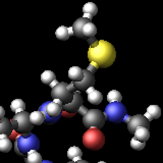
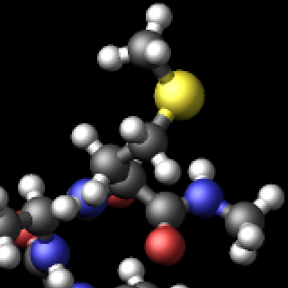
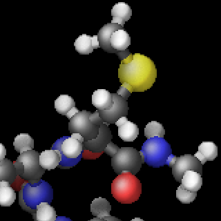
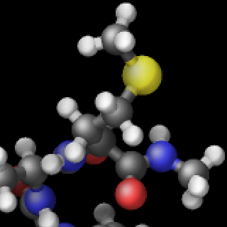

|imagequality1|  |imagequality2|  |imagequality3|  |imagequality4|

The computational cost to create the images with :doc:`dump image
<dump_image>` depends on the image size, the number of objects to be
rendered (this number can grow quickly when using fine triangle meshes),
and the choice of the *fsaa* and *ssao* settings.  For high resolution
images, a correspondingly large image size has to be chosen.

Since the simulation has to wait for the dump image command to complete
its image rendering, creating high resolution, high quality images can
slow down a simulation significantly with frequent output of images.  On
the other hand, the image rasterizer in LAMMPS is fairly simple and thus
fast compared to more advanced image generation tools like ray tracers.
The method it uses to generate the images allows to have each MPI
process create image data for the atoms and objects they "own" and then
this image data is merged for the final output with a procedure that has
O(log(N)) complexity with the number of MPI processes.  At the moment
there is no GPU acceleration and only limited multi-threading
parallelization available (e.g. for SSAO post-processing of image data).

--------------------

Color selection and color management
------------------------------------

The :doc:`dump image <dump_image>` command in LAMMPS has a variety
of options to assign colors to the rendered graphics.  In most cases
the color is assigned to atom (or bond) types and uses a default map
with six colors as follows:

* type 1 = red
* type 2 = green
* type 3 = blue
* type 4 = yellow
* type 5 = aqua
* type 6 = cyan

and repeats itself for types :math:`> 6`.  This mapping can be changed by the
"dump_modify acolor" command, though.  If you want to change the color of a
specific atom type, you can use :doc:`dump modify acolor <dump_image>`.  For
example to color atoms of type 1 in gray and type 2 in white, you would use:

.. code-block:: LAMMPS

   dump_modify img  acolor 1 gray acolor 2 white

There are 144 predefined colors, but you can add new colors or modify
existing ones, too, with the *dump_modify color* keyword.  The *color*
keyword is followed by the name of the color and the intensity of the
red, green, and blue components (R/G/B) in a range from 0.0 to 1.0. Here
is an example to create eight new color names followed by the *acolor*
keyword with a wildcard to replace the default map of six atom colors
with a new map of the either newly defined colors.

.. code-block:: LAMMPS

   dump_modify viz color map1 0.012 0.016 0.322 color map2 0.008 0.243 0.541 &
       color map3 0 0.467 0.714 color map4 0 0.588 0.780 color map5 0 0.706 0.847 &
       color map6 0.282 0.792 0.894 color map7 0.565 0.878 0.937 color map8 0.792 0.941 0.973 &
       acolor * map1/map2/map3/map4/map5/map6/map7/map8

Yet another option is to color the atoms by element.  The per-element
colors are predefined but LAMMPS does not know which element an atom
type corresponds to and by default uses carbon for all atom types.  The
correct element information needs to be provided with a *dump_modify
element* command followed by an element name for each atom type. In case
of the ``peptide`` example bundled with LAMMPS this would be:

.. code-block:: LAMMPS

   dump viz peptide image 1000 image-*.png element type size 600 600 zoom 2.0
   dump_modify viz element C C O H N C C C O H H S O H

Finally, atoms can be colored by the value of a per-atom property using
a color map.  There are several variants of color maps.  Here is a
simple example coloring the atoms in the ``peptide`` example by their
charge with a continuous color map where white is neutral, red positive,
blue negative, and the color intensity corresponds to the magnitude of
the charge:

.. code-block:: LAMMPS

   dump viz peptide image 1000 image-*.png q type size 600 600 zoom 2.0
   dump_modify amap -1.0 1.0 ca 0 3 min blue 0.0 white max red

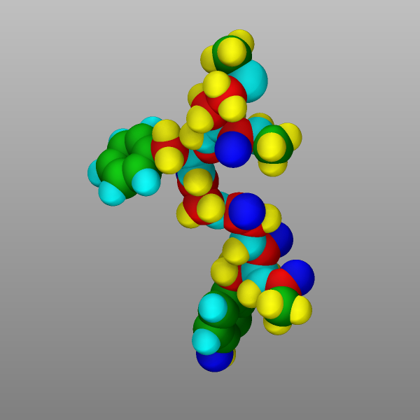
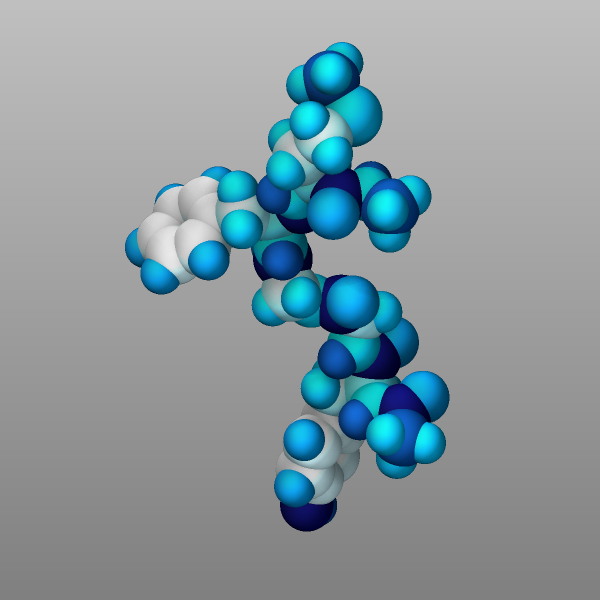
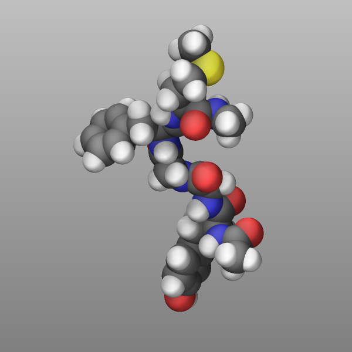
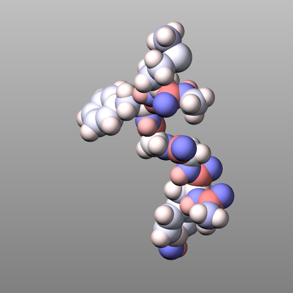

|colors1|  |colors2|  |colors3|  |colors4|

.. raw:: html

   
(Different colorization styles. Left to right: by default
   type map, by custom type map, by element, and by charge. Click to see
   the full-size images)

--------------------

Transparency
------------

It is now possible to create approximately transparent graphics objects
using an `ordered dithering algorithm
<https://en.wikipedia.org/wiki/Ordered_dithering>`_ which results in a
so-called *screen-door transparency* effect.  In essence, for a
transparent object only a part of the pixels are drawn and thus exposing
any object behind the transparent object where drawing the pixels is
skipped.  LAMMPS employs a 16x16 Bayer matrix pattern that leads to
rather regular patterns.  A benefit of this approach is that it does not
add extra cost to the rendering and for a 25%, 50%, and 75% transparency
setting, there are no visible pixel patterns when also FSAA is enabled.
In this case each pixel is the average of a 2x2 block of pixels in an
image of double the width and height, and thus the transparent object
will contribute 3, 2, or 1 pixels to the 2x2 block which is averaged.

Transparency is typically - like the color of objects - associated with
an atom type and can be modified through the :doc:`dump_modify atrans
<dump_image>` command and specified as an opacity ratio, i.e. a number
between 0 (fully transparent) and 1 (fully opaque).  Other choices are
available and described in the documentation page.

.. |transparency1| image:: img/transparent-1.png
   :width: 49%
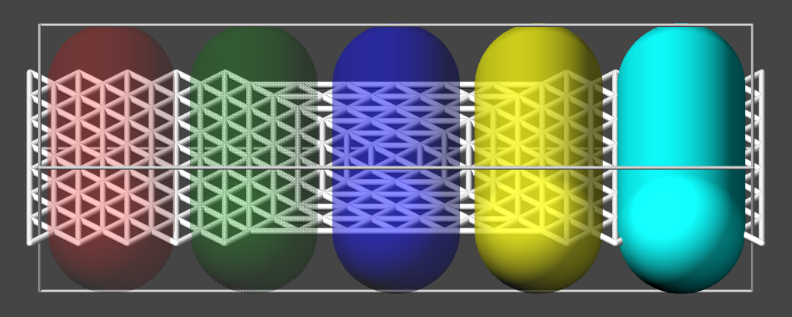

|transparency1|  |transparency2|

.. raw:: html

   
(Transparency example with opacity set to 0.25, 0.33, 0.5,
   0.75, and 1.0 (left to right): left: without FSAA, right: with
   FSAA. Click to see the full-size images)

-----------------------

Creating and viewing animated GIFs and movie files
--------------------------------------------------

A series of JPEG, PNG, or PPM images can be converted into a movie file
and then played as a movie using commonly available tools.  Using dump
style *movie* automates this step *and* avoids the intermediate step of
writing (many) image snapshot file.  But LAMMPS has to be compiled with
``-DLAMMPS_FFMPEG`` and a compatible FFmpeg executable has to be
installed.  When using `LAMMPS-GUI <https://lammps-gui.lammps.org/>`_ to
run LAMMPS, you can run the simulation and LAMMPS-GUI will automatically
show the created images in its ``Slideshow Viewer`` dialog.  From there
you can animate or single step through them and also export them to a
movie file via FFMpeg.

To manually convert JPEG, PNG or PPM files into an animated GIF or
MPEG or other movie file you can use:

#. Use the ImageMagick ``convert`` program (called ``magick`` in recent versions).

   .. code-block:: bash

      convert *.jpg foo.gif
      convert -loop 1 *.ppm foo.mpg

   Animated GIF files from ImageMagick are not optimized. You can use
   a program like gifsicle to optimize and thus massively shrink them.
   MPEG files created by ImageMagick are in MPEG-1 format with a rather
   inefficient compression and low quality compared to more modern
   compression styles like MPEG-4, H.264, VP8, VP9, H.265 and so on.

#. Use QuickTime.

   Select "Open Image Sequence" under the File menu Load the images into
   QuickTime to animate them Select "Export" under the File menu Save the
   movie as a QuickTime movie (\*.mov) or in another format.  QuickTime
   can generate very high quality and efficiently compressed movie
   files. Some of the supported formats require to buy a license and some
   are not readable on all platforms until specific runtime libraries are
   installed.

#. Use FFmpeg

   `FFMpeg <https://ffmpeg.org/>`_ is a command-line tool that is
   available on many platforms and allows extremely flexible encoding
   and decoding of movies.

   .. code-block:: bash

      cat snap.*.jpg | ffmpeg -y -f image2pipe -c:v mjpeg -i - -b:v 2000k movie.m4v
      cat snap.*.ppm | ffmpeg -y -f image2pipe -c:v ppm -i - -b:v 2400k movie.mp4

   Front ends for FFmpeg exist for multiple platforms. For more
   information see the `FFmpeg homepage <https://ffmpeg.org/>`_

----------

Play the movie:

#. Use your web browser to view an animated GIF or MP4 movie format movie.

   Select "Open File" under the File menu
   Load the animated GIF or MP4 movie file

#. Use the freely available `VideoLAN media player (vlc)
   <https://videolan.org>`_ or `FFMpeg player tool (ffplay)
   <https://ffmpeg.org/>`_ to view a movie.

   Both are available for multiple operating systems and support a large
   variety of file formats and decoders.  There are plenty more media
   player packages available on the different operating systems.

   .. code-block:: bash

      vlc foo.mpg
      ffplay bar.avi

#. Use the `Pizza.py <https://lammps.github.io/pizza/>`_
   `animate tool <https://lammps.github.io/pizza/doc/animate.html>`_,
   which works directly on a series of image files.

   .. code-block:: python

      a = animate("foo*.jpg")

#. QuickTime and other Windows- or macOS-based media players can
   obviously play movie files directly. Similarly for corresponding tools
   bundled with Linux desktop environments.  However, due to licensing
   issues with some file formats, the formats may require installing
   additional libraries, purchasing a license, or may not be
   supported.

--------------

Prototyping dump image visualizations with LAMMPS-GUI
-----------------------------------------------------

One of the challenges when using :doc:`dump image <dump_image>` for
creating visualizations compared to the likes of `OVITO
<https://www.ovito.org>`_ and `VMD
<https://www.ks.uiuc.edu/Research/vmd/>`_ is that it is non-interactive
and it can be tedious and time consuming to find suitable settings for
camera view or zoom factor and others for a specific system.  You would
have to run LAMMPS to create an image, then view it in an image viewer
program, edit the input file and repeat the process until you have found
settings that you like.

This process can be streamlined with `LAMMPS-GUI
<https://lammps-gui.lammps.org/>`_, which does not contain its own
visualization code, but rather uses :doc:`dump image <dump_image>`
through the :doc:`LAMMPS C-language library interface <Library>` and
displays the resulting images for its `Image Viewer Dialog
<https://lammps-gui.lammps.org/visualization.html>`_.  Through the GUI
elements and dialogs many settings can be adjusted and then the image
will be recreated with the updated settings and thus allowing to refine
a visualization in a quasi-interactive fashion.  The resulting command
lines can be transferred to the cut-n-paste buffer of the windowing
system and pasted into the input file and then further adjusted.

Once the input contains a :doc:`dump image <dump_image>` command,
LAMMPS-GUI will notice when a new image has been created and load it
into "Slide Show Dialog".  This streamlines the process of building more
complex visualizations once you have copied it into the input since you
have editor and image viewer as part of the same program and can quickly
start and stop LAMMPS with a mouse click or keystroke.  A large part of
the visualization examples on shown in this Howto page have been created
this way.

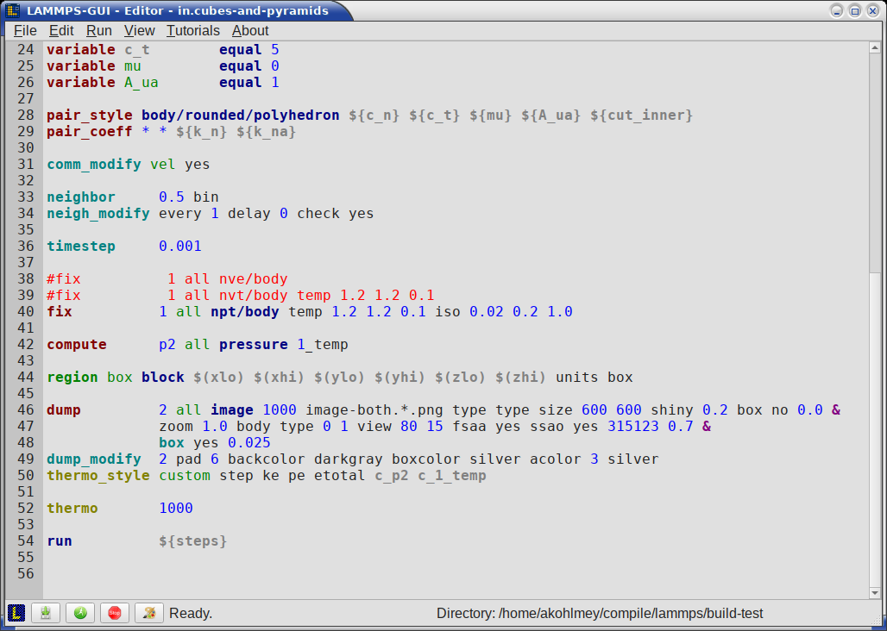
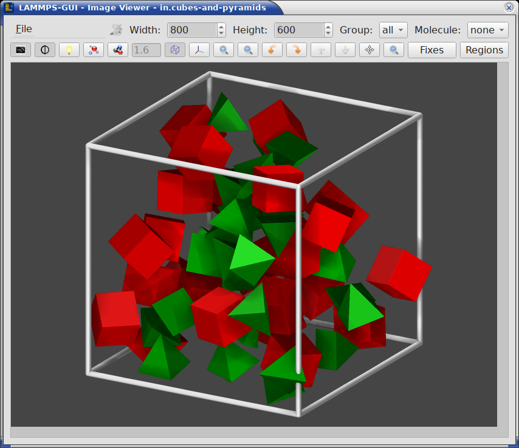
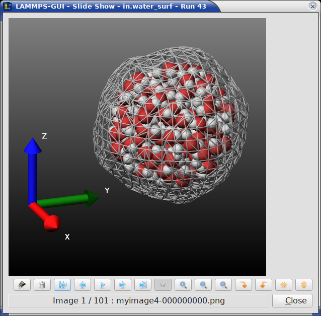

|gui1|  |gui2|  |gui3|

--------------

Visualizing systems using potentials with implicit bonds
--------------------------------------------------------

There are several pair styles available in LAMMPS where the bond
information is not taken from from the bond topology in a data file but
the potentials first determine a "bond-order" parameter for pairs of
atoms and - depending on the value of that parameter - apply forces for
bonded interactions.  This applies to :doc:`ReaxFF <pair_reaxff>`,
:doc:`REBO and AIREBO <pair_airebo>`, :doc:`BOP <pair_bop>`, and several
others pair styles.  These implicit bonds will not be shown by
:doc:`dump image <dump_image>` since its mechanism for displaying bonds
relies on explicit bonds being present in the bond topology.

One can hide the fact that there are no bonds by setting the atom radii
to the covalent radii of the corresponding elements (see leftmost
example image below).  This will result in a representation often
labeled as "VDW" in popular visualization tools.  Otherwise, there are
currently three approaches to make those bonds visible.

#. Access the (internal) bond order information from the pair style
   through a custom fix and then use the *fix* keyword of the :doc:`dump
   image <dump_image>` command to use the graphics objects information
   provided by the fix to visualize the bonds (see below for more
   information).  That includes bonds that are broken and formed.  This
   is the most accurate option since it uses the data that is used by
   the computation of the model.  This is currently only available for
   ReaxFF by using :doc:`fix reaxff/bonds <fix_reaxff_bonds>`.

#. Use the *autobonds* keyword of :doc:`dump image <dump_image>` to
   approximate the bonds based on a simple distance heuristic.  This is
   similar to the *Dynamic Bonds* representation in `VMD
   <https://www.ks.uiuc.edu/Research/vmd/>`_.  How accurate this option
   will be depends on the complexity of the system and how many
   different bond lengths there are.  For the simple water system shown
   below, there are no significant differences, since there is only one
   type of bond (between oxygen and hydrogen).  The *autobond* keyword
   uses on top of the distance cutoff between atoms, the heuristic that
   no bonds will be drawn between two hydrogen atoms and thus bogus
   bonds are avoided when using a larger bond cutoff (e.g. suitable for
   carbon-carbon bonds) which is larger than the typical
   hydrogen-hydrogen distance for hydrogen atoms bound to the same atom
   (e.g. in water, methane or hydrocarbon chains).

#. Use use a combination of :doc:`fix bond/break <fix_bond_break>`
   and :doc:`fix bond/create/angle <fix_bond_create>` with :doc:`bond
   style zero <bond_zero>` to dynamically create and remove bonds that
   do not add any forces.  This also requires to tell the neighbor list
   code to not treat any pairs of atoms as special neighbors (otherwise
   the corresponding pairs of atoms could be excluded from the neighbor
   list and thus the forces computed by the pair style incorrect)
   through using the :doc:`special_bonds <special_bonds>` command.
   Unlike the two other options which were recently added when this
   document when was written, this method also works with older versions
   of LAMMPS.  Here is an example of the necessary commands for a carbon
   nanotube (that is modeled with AIREBO):

   .. code-block:: LAMMPS

      bond_style zero
      bond_coeff 1 1.4
      special_bonds lj/coul 1.0 1.0 1.0
      fix break all bond/break 1000 1 2.5
      fix form all bond/create/angle 1000 1 1 2.0 1 aconstrain 90.0 180

   This "graphics hack" was originally posted as part of the LAMMPS
   tutorial at
   https://lammpstutorials.github.io/sphinx/build/html/tutorial2/breaking-a-carbon-nanotube.html

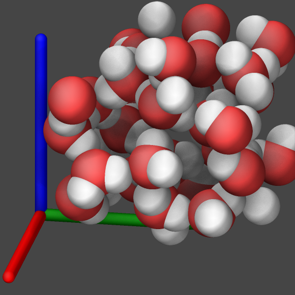
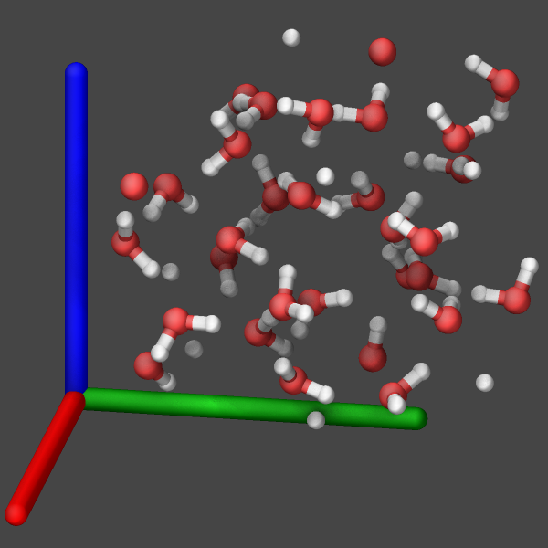
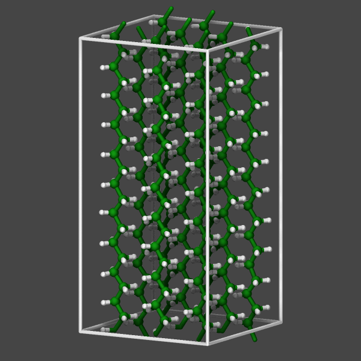
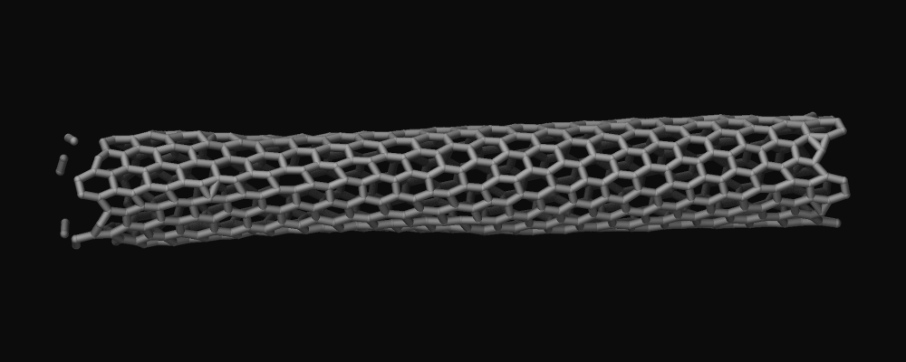

|bonds0|  |bonds1|  |bonds2|  |bonds3|

.. raw:: html

   
(Visualizing systems with implicit bonds. Left to right:
   using covalent radii, using fix reaxff/bonds, using <i>autobond</i>,
   using fix bond/create/angle. Click to see the full-size
   images)

-------------

.. Visualizing tri or line particles
.. ---------------------------------
..
.. -------------

Visualizing body particles
--------------------------

Body particles are objects formed from either a collection of spherical
particles, polygons (in 2d), or polyhedra (in 3d) formed from triangular
or quadrilateral surfaces.  The regular :doc:`dump <dump>` command can
only output the center of those bodies (and their orientation), which
complicates the visualization with external tools.  In addition, the
position of the constituent particles of *nparticles* bodies or the
positions of the vertices of *rounded/polygon* or *rounded/polyhedron*
bodies, which can be computed with :doc:`compute body/local
<compute_body_local>` and output with :doc:`dump local <dump>`.

As an alternative, the bodies can be visualized directly with :doc:`dump
image <dump_image>` using the *body* keyword.  Without the *body*
keyword the body particles would be visualized like atoms as single
spheres.  The color and transparency settings can be changed by settings
those properties for the corresponding atom types.  It is also possible
to represent the bodies as either wireframes (*bflag1* value 2), planar
faces (*bflag1* value 1), or both (*bflag1* value 3).

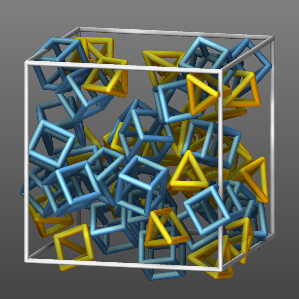
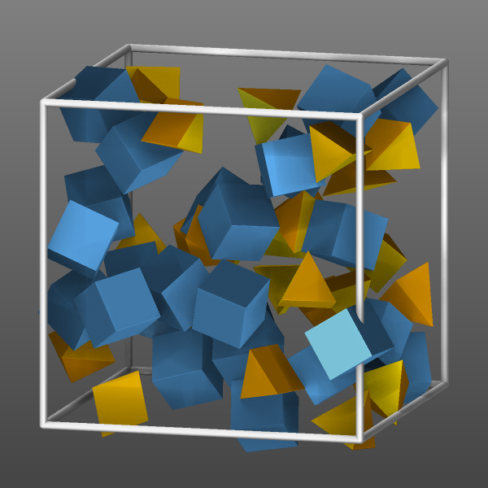
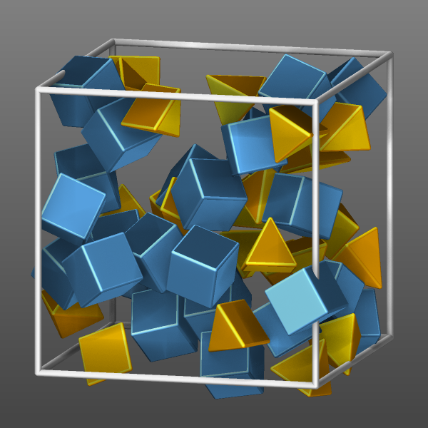

|body1|  |body2|  |body3|

.. raw:: html

   
(Body particle visualization examples for the
   <i>rounded/polyhedron</i> body style left: frames, center: faces,
   right: both. Click to see the full-size images)

-------------

Visualizing ellipsoid particles
-------------------------------

Ellipsoidal particles are a generalization of spheres that may have
three different radii to define the shape.  They can be modeled using
pair styles :doc:`gayberne <pair_gayberne>` or :doc:`resquared
<pair_resquared>`.  The regular :doc:`dump custom <dump>` command can
output the center of those bodies, the shape parameters and the
orientation as quaternions.  If one follows the required conventions and
follows the documented steps, those trajectory dump files can be
`imported and visualized in OVITO
<https://www.ovito.org/manual/advanced_topics/aspherical_particles.html>`_

As an alternative, the ellipsoid particles can be visualized directly
with :doc:`dump image <dump_image>` using the *ellipsoid* keyword.  The
color and transparency settings can be changed by settings those
properties for the corresponding atom types.  It is also possible to
represent the ellipsoids via generating a triangle mesh and visualizing
it as either wireframes (*eflag* value 2), planar faces (*eflag* value
1), or both (*eflag* value 3), same as demonstrated for body particles
above.  The use of a triangle mesh is currently required since the
rasterizer built into LAMMPS does not offer a suitable graphics
primitive for ellipsoids.  The mesh is constructed by iteratively
refining a triangle mesh representing an octahedron where each triangle
is replaced by four triangles.  For a smooth representation a refinement
level of 5 or 6 is required, which will cause a significant slowdown of
the rendering of the image.  Also, some artifacts can happen due to
rounding which can be somewhat minimized using FSAA (which causes
further slowdown of the rendering).

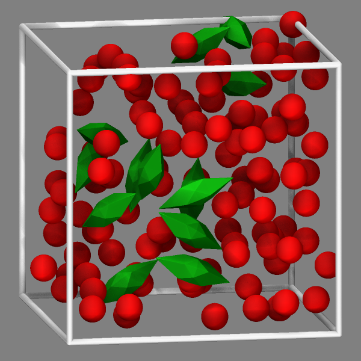
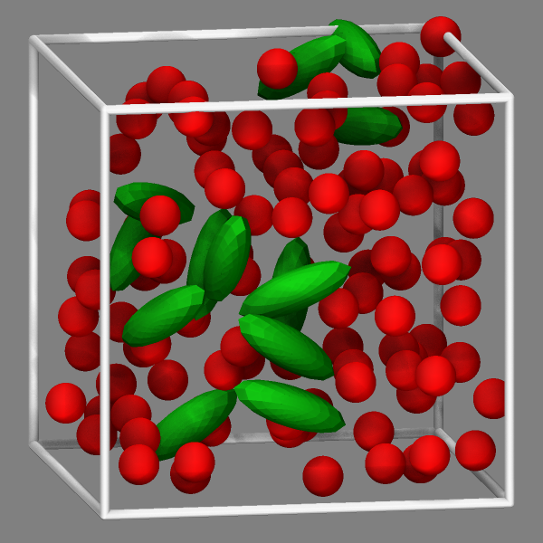
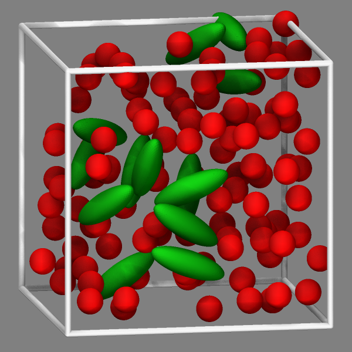

|ellipsoid1|  |ellipsoid2|  |ellipsoid3|

.. raw:: html

   
(Ellipsoid particle visualization examples for different mesh refinement levels.
   left: level 2, center: level 4, right: level 6. Click to see the full-size images)
 

These images were created by adding the following :doc:`dump image and dump_modify <dump_image>`
commands to the ``in.ellipse.resquared`` input example:

.. code-block:: LAMMPS

   #                                                       change + this
   dump viz all image 1000 image-*.png type type ellipsoid type 3 4 0.05 &
         size 600 600 zoom 2.2 shiny 0.1 fsaa yes view 80 -10 box yes 0.025 &
         axes no 0.0 0.0 center s 0.5 0.5 0.5 ssao yes 32185474 0.6
   dump_modify viz pad 9 boxcolor white backcolor gray adiam 1 4 adiam 2 7

-------------

Visualizing regions
-------------------

Since there are several commands that operate on atoms within a specific
:doc:`region <region>` , it can be helpful to visualize the extent of
those regions, either for debugging the command settings or for
visualizing the production simulation.  This is even more useful when
regions are (dynamically) translated or rotated or both with the
*rotate* or *move* keyword of the *region* command.  The :doc:`dump
image region <dump_image>` keyword can be used to enable such
visualizations.  There are currently four different draw styles
available:

* *filled*: a mesh of triangles is constructed for the surface of the
  region and then drawn in the selected color.  This draw style accounts
  for the *open* keyword of the :doc:`region <region>` command and only
  draws the faces of a region that are closed.
* *transparent*: this is the same visualization as draw style *filled*,
  but in addition one can set the transparency of that visualization
  through an opacity parameter in the range of 0.0 (invisible) to 1.0
  (fully opaque).
* *frame*: uses the same mesh of triangles as the two styles above
  above, but renders the region's surface as a wireframe mesh with a
  given cylinder diameter.
* *points*: generates a cloud of random points inside the simulation box
  and then only draws a point as a sphere with the given color and
  radius if it is located inside the region.  This is useful to check
  the impact of the *side in/out* setting of a region, and complementary
  to the other three draw styles, which only show the region surfaces.
  For visualization purposes any open faces of a region are ignored,
  since a region with an open face matches *all* particles.

It can sometimes be convenient to draw the same region with multiple
draw styles as can be seen from the example visualization images below.

Notes on the visualization of individual region styles:

* *plane*: since in theory planes extend infinitely, some form of
  boundary has to be established for the visualization.  Therefore a
  mesh of triangles is constructed and transformed according to the
  region settings and then only those triangles are drawn, where at
  least one corner is inside the simulation box.  For draw style
  *points* the *side in/out* setting determines on which side of the
  plane the points are drawn.
* *cone* and *cylinder*: use triangle meshes for draw styles *filled*
  and *transparent* since there are no equivalent primitives (the
  cylinder primitive only draws half of the cylinder, since it is
  optimized for being capped).  For draw style *frame*, only the rim
  of the top or bottom is drawn and the side is represented by lines
  from the top to the bottom.
* *box* and *prism*: for draw style *frame* only the edges of the region
  are shown; for draw styles *filled* and *transparent*, the faces are
  drawn instead, but only if they are not set as "open" in the
  :doc:`region <region>` command.

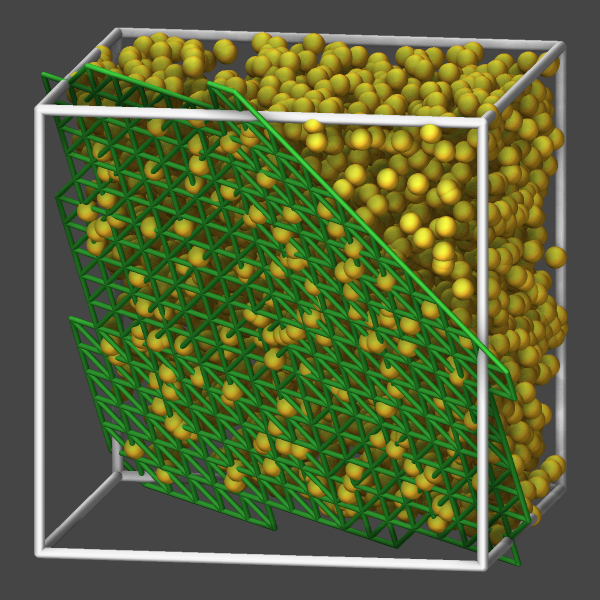
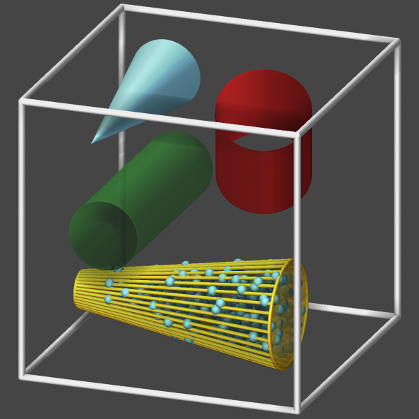
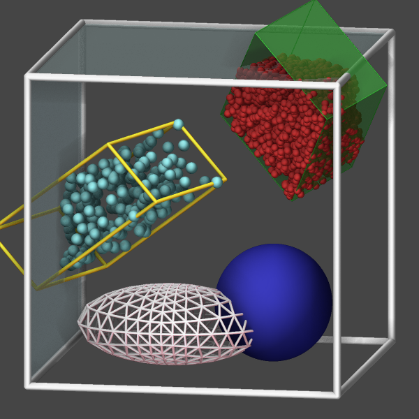

|region1|  |region2|  |region3|

.. raw:: html

   
(Region visualization examples. Click to see the full-size images)
 

Below is an example input deck for visualizing *cone* and *cylinder* regions:

.. code-block:: LAMMPS

   region      box block -2 2 -2 2 -2 2
   create_box 0 box

   variable rot equal PI*step/1000.0

   region c1 cylinder x -1.0 0.0 0.5 -1.5 1.5 open 1 open 2
   region c2 cone y  1.0 -1.0 0.25 0.75 -1.5 1.5 open 3
   region c3 cylinder z  0.0 1.0 0.66 -0.1 1.5 open 1 open 2 rotate v_rot 0.3 0.0 0.3 0.0 1.0 1.0
   region c4 cone x -1.0 1.5 0.5 0.0 -1.0 2.0

   dump viz all image 100 image-*.png type type size 600 600 zoom 1.4 shiny 0.1 view 70 20 &
                box yes 0.025 axes no 0.0 0.0 fsaa yes ssao yes 314123 0.7 &
                region c1 forestgreen transparent 0.5 &
                region c2 goldenrod frame 0.05 &
                region c2 cadetblue points 10000 0.15 &
                region c2 goldenrod transparent 0.5 &
                region c3 firebrick filled &
                region c4 skyblue filled
   dump_modify viz pad 4 boxcolor silver backcolor darkgray

   run 500

-------------

Visualizing graphics provided by fix commands
---------------------------------------------

LAMMPS can display additional graphics objects in the :doc:`dump image
<dump_image>` output that are added by fix styles.  These fall in two
categories: fixes that were written with the specific purpose of adding
graphics to the visualization and fixes that make objects or data
visible that they maintain internally.  Examples for the latter case are
visualizing the indenter object from :doc:`fix indent <fix_indent>` or
the wall position from one of the wall fixes.  The details of what kind
of graphics is added and how it can be configured is described in a
section titled **Dump image info** in the documentation of the
individual fix commands.

Below is a table with links to the documentation of supported fix
styles:

.. table_from_list::
   :columns: 4

   * :doc:`fix graphics/arrows <fix_graphics_arrows>`
   * :doc:`fix graphics/isosurface <fix_graphics_isosurface>`
   * :doc:`fix graphics/labels <fix_graphics_labels>`
   * :doc:`fix graphics/objects <fix_graphics_objects>`
   * :doc:`fix graphics/periodic <fix_graphics_periodic>`
   * :doc:`fix indent <fix_indent>`
   * :doc:`fix reaxff/bonds <fix_reaxff_bonds>`
   * :doc:`fix smd/wall_surface <fix_smd_wall_surface>`
   * :doc:`fix wall/body/polygon <fix_wall_body_polygon>`
   * :doc:`fix wall/body/polyhedron <fix_wall_body_polyhedron>`
   * :doc:`fix wall/ees <fix_wall_ees>`
   * :doc:`fix wall/lj93 <fix_wall>`
   * :doc:`fix wall/lj126 <fix_wall>`
   * :doc:`fix wall/lj1043 <fix_wall>`
   * :doc:`fix wall/colloid <fix_wall>`
   * :doc:`fix wall/gran <fix_wall_gran>`
   * :doc:`fix wall/harmonic <fix_wall>`
   * :doc:`fix wall/harmonic/outside <fix_wall>`
   * :doc:`fix wall/lepton <fix_wall>`
   * :doc:`fix wall/morse <fix_wall>`
   * :doc:`fix wall/reflect <fix_wall_reflect>`
   * :doc:`fix wall/reflect/stochastic <fix_wall_reflect_stochastic>`
   * :doc:`fix wall/srd <fix_wall_srd>`
   * :doc:`fix wall/table <fix_wall>`

There is no support for :doc:`fix wall/region <fix_wall_region>` and
:doc:`fix wall/gran/region <fix_wall_gran_region>`, since regions can be
visualized with the *region* keyword of :doc:`dump image <dump_image>`
(see discussion above).

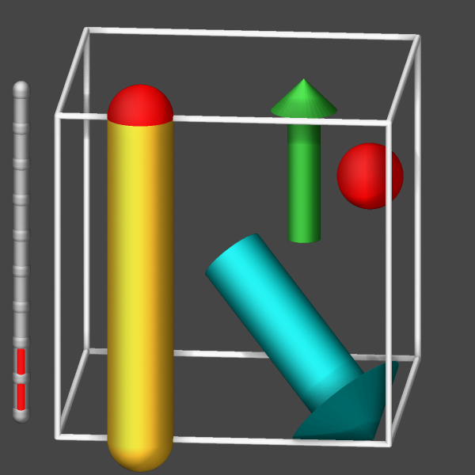
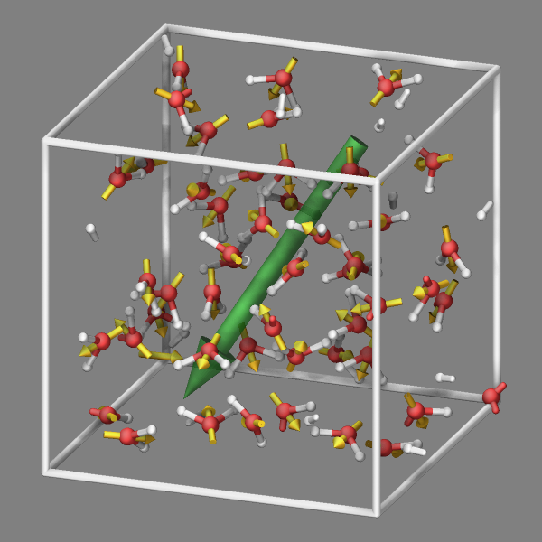
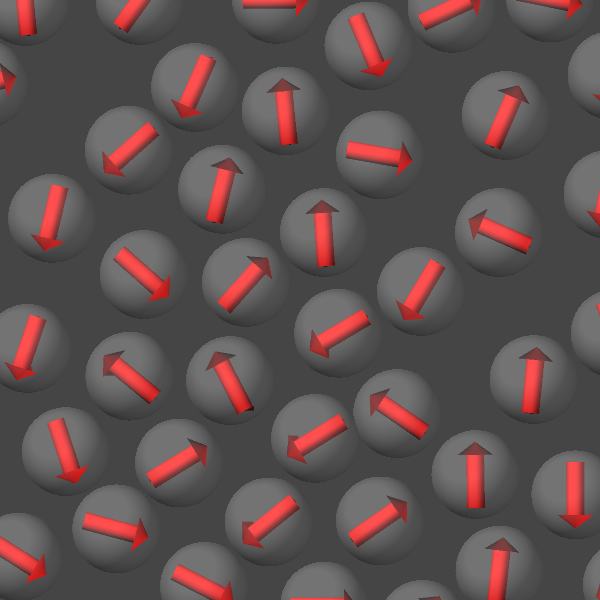
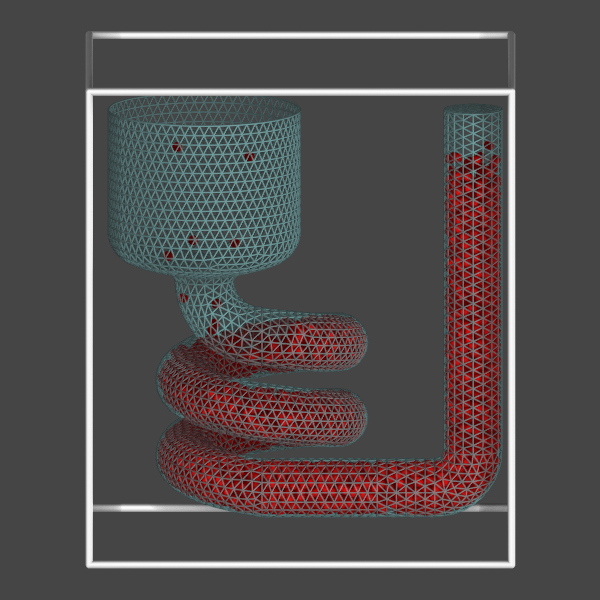
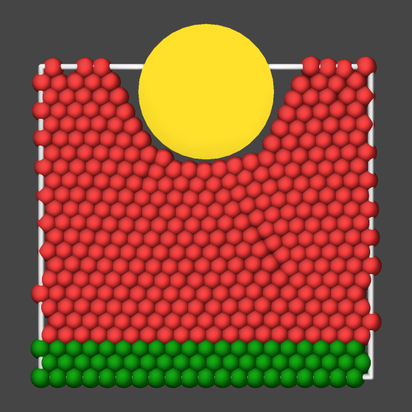

|fix1|  |fix2|  |fix3|  |fix4|  |fix5|

.. raw:: html

   
(Fix graphics visualization examples. Click to see the full-size images)
 

Below are discussions about some aspects of specific fix commands and some input examples.

-------------

Fix graphics/objects
^^^^^^^^^^^^^^^^^^^^

Fix :doc:`graphics/objects <fix_graphics_objects>` adds some graphics
primitives and more complex objects like a progress bar to the
visualization where properties of the object(s) are controlled by
:doc:`equal-style or compatible variables <variable>`.

Fix graphics/labels
^^^^^^^^^^^^^^^^^^^

Fix :doc:`graphics/labels <fix_graphics_labels>` adds graphics from
pixmaps to the visualization.  These can be either images or text that
is rendered internally into a pixmap with a background and a frame.
Those pixmaps can be scaled, moved, made transparent, and updated during
the simulation and then integrated into the :doc:`dump image
<dump_image>` output.  In both cases a "transparency" color can be
chosen to skip copying any pixels of that color to make parts of the
pixmap transparent.  The text labels can contain :doc:`variables
<variable>` that will be expanded in the same was as with :doc:`fix
print <fix_print>` so they can report values of computed properties.
Label positions are provided in the frame of reference of the simulation
box and thus they can obscure other objects in then visualization or be
obscured by objects.

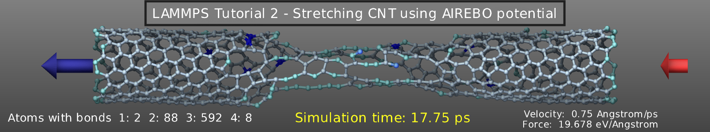

   Example image using graphics objects and labels that are updated during
   the simulation.

-----------------------

Fix graphics/arrows
^^^^^^^^^^^^^^^^^^^

Fix :doc:`graphics/arrows <fix_graphics_arrows>` adds per-atom or
per-chunk arrows to the visualization.  The arrows represent some
per-atom property or per-chunk 3-vector property.  For atoms, there are
the pre-defined properties *force*, *velocity*, and *dipole* (requires
atom style *dipole*).  Everything else would have to be computed in
:doc:`atom-style or compatible variables <variable>` and use the
*variable* keyword.  For per-chunk properties, one needs to use the
*chunk* keyword and provide the IDs of three computes: a
:doc:`chunk/atom compute <compute_chunk_atom>` and two per-chunk
computes where the first defines the position of the (middle of the)
arrow and the second the direction and length of the arrow.  Popular
choices would create per-molecule or per-bin chunks.  Below is an
example input section that computes and displays both, the total dipole
moment (using :doc:`fix graphics/objects <fix_graphics_objects>` and the
per-molecule dipole moment as arrows in addition to the per-atom
velocities:

.. code-block:: LAMMPS

   compute molchunk all chunk/atom molecule
   compute cpos all com/chunk molchunk wrap yes
   compute cdip all dipole/chunk molchunk
   fix vel all graphics/arrows 10 velocity 50.0 0.066 autoscale 0.25
   fix vec all graphics/arrows 10 chunk molchunk cpos cdip 3 0.1

   compute dip all dipole
   variable scale equal 0.75
   variable dip1x equal -v_scale*c_dip[1]
   variable dip1y equal -v_scale*c_dip[2]
   variable dip1z equal -v_scale*c_dip[3]
   variable dip2x equal v_scale*c_dip[1]
   variable dip2y equal v_scale*c_dip[2]
   variable dip2z equal v_scale*c_dip[3]
   fix dipole all graphics/objects 1 arrow 1  v_dip1x v_dip1y v_dip1z v_dip2x v_dip2y v_dip2z 0.3 0.2

   dump viz all image 100 image-*.png element type size 600 600 zoom 1.3 view 70 20 shiny 0.1 &
                bond atom 0.2box yes 0.025 axes no 0.0 0.0 center s 0.5 0.5 0.5 fsaa yes &
                fix dipole const 0 0 fix vec const 0 0 fix vel const 0 0 ssao yes 315465 0.8
   dump_modify viz pad 6 boxcolor white backcolor gray element O H  bdiam 1 0.2 &
                adiam 1 0.5 adiam 2 0.3 acolor 1 silver acolor 2 red fcolor vec goldenrod &
                fcolor dipole forestgreen ftrans dipole 0.75 fcolor vel cyan ftrans vel 0.5

Fix graphics/isosurface
^^^^^^^^^^^^^^^^^^^^^^^

Fix :doc:`graphics/isosurface <fix_graphics_isosurface>` adds a
triangulated surface following a given isovalue through a 3d-grid of
data of some per-atom property.  The data is spread out using a Gaussian
distribution with a given width and can be just a value of 1 (leading
to a grid representing the number density) or mass or some other computed
per-atom property from a :doc:`compute <compute>`, :doc:`fix <fix>`, or
atom-style :doc:`variable <variable>`.  The isosurface can be represented
by either a wireframe or a mesh of triangles and there are five choices
for the resolution of the grid and thus the smoothness of the surface.

The commands below provide an example for how to use the
*graphics/isosurface* fix to visualize the water and lipid bilayer of
the "rhodo" benchmark example as isosurfaces by using a green wireframe
and a transparent white triangle surface to represent those molecules.

.. code-block:: LAMMPS

   group water type 4 33
   group membrane type 36 37 38 39 40 41 42 43 44 45 46 47 48 49 50 51
   group other subtract all water membrane

   fix water water graphics/isosurface 100 30.0 3.0 quality high property mass
   fix membrane membrane graphics/isosurface 100 25.0 4.0 quality low property mass

   dump viz other image 100 image-*.png element type size 600 600 zoom 1.4641 view 80 10 &
                  shiny 0.2 fsaa yes bond atom type box yes 0.025  &
                  fix membrane const 2 0.33 fix water const 1 0.2
   dump_modify viz pad 9 boxcolor silver backcolor gray &
          fcolor membrane darkgreen ftrans membrane 1.0 ftrans water 0.5 &
          element H H H H H H H H H C C C C C C C C C C C C C N N N N N N N O O O O S S &
                  H H H H H C C C C C C N O O O P Cl Na H H H N C C C C C C C C C C C &
          adiam 1 1.92 adiam 2 1.92 adiam 3 1.92 adiam 5 1.92 adiam 6 1.92 adiam 7 1.92 adiam 8 1.92 &
          adiam 9 1.92 adiam 10 2.72 adiam 11 2.72 adiam 12 2.72 adiam 13 2.72 adiam 14 2.72 &
          adiam 15 2.72 adiam 16 2.72 adiam 17 2.72 adiam 18 2.72 adiam 19 2.72 adiam 20 2.72 &
          adiam 21 2.72 adiam 22 2.72 adiam 23 2.48 adiam 24 2.48 adiam 25 2.48 adiam 26 2.48 &
          adiam 27 2.48 adiam 28 2.48 adiam 29 2.48 adiam 30 2.432 adiam 31 2.432 adiam 32 2.432 &
          adiam 34 2.88 adiam 35 2.88 adiam 52 3.632 adiam 53 2.176 adiam 54 1.92 adiam 55 1.92 &
          adiam 56 1.92 adiam 57 2.48 adiam 58 2.72 adiam 59 2.72 adiam 60 2.72 adiam 61 2.72 &
          adiam 62 2.72 adiam 63 2.72 adiam 64 2.72 adiam 65 2.72 adiam 66 2.72 adiam 67 2.72 adiam 68 2.72

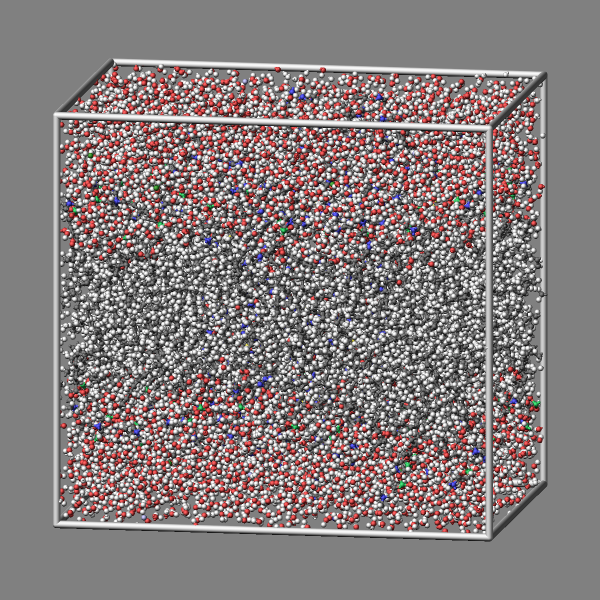
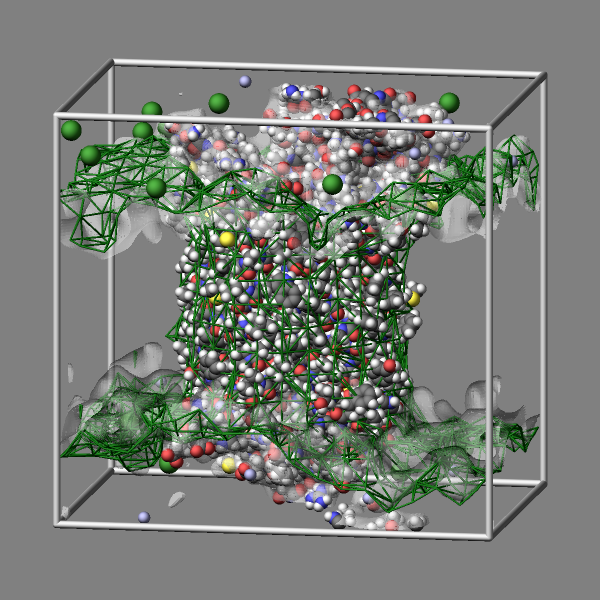

|isosurface1|  |isosurface2|

.. raw:: html

   
(Isosurface graphics visualization example. Click to see the full-size images)
 

Fix reaxff/bonds
^^^^^^^^^^^^^^^^

Fix :doc:`reaxff/bonds <fix_reaxff_bonds>` of the :ref:`REAXFF package
<pkg-reaxff>` provides access to the list of bonds as they are
dynamically computed by the :doc:`ReaxFF pair style <pair_reaxff>`.  As
discussed above, this can be used to visualize bonds for a system where
there is no explicit bond topology defined.

Fix smd/wall_surface
^^^^^^^^^^^^^^^^^^^^

Fix :doc:`smd/wall_surface <fix_smd_wall_surface>` of the :ref:`MACHDYN
package <pkg-machdyn>` creates a custom wall from a mesh of triangles
that is read from an STL format file.
