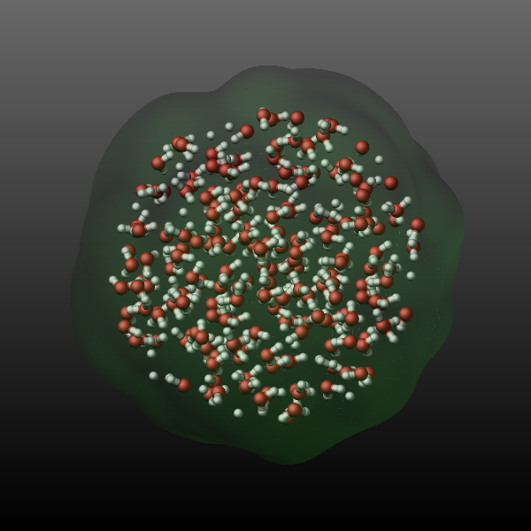
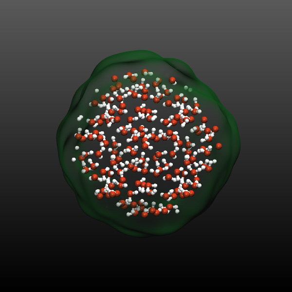
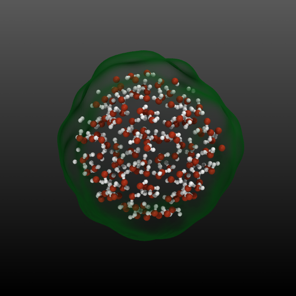

.. index:: fix graphics/isosurface

fix graphics/isosurface command
===============================

Syntax
""""""

.. code-block:: LAMMPS

   fix ID group-ID graphics/isosurface Nevery isovalue radius keyword args ...

* ID, group-ID are documented in :doc:`fix <fix>` command
* graphics/isosurface = style name of this fix command
* Nevery = update graphics information every this many time steps
* isovalue = isovalue for the particle property isosurface selection
* radius = radius describing the spread of the atoms to the density grid (distance units)
* one or more keyword/args pairs may be appended
* keyword = *quality* or *property* or *filename* or *binary* or *pad*

  .. parsed-literal::

     *quality* keyword = isosurface grid resolution setting
        keyword = one of *min*, *low*, *med*, *high*, or *max*
     *property* value = per-atom property used to create the isosurface grid
        value = *none*, *mass*,  c_ID, c_ID[i], f_ID, f_ID[i], v_name
           *none* = 1.0 for all atoms
           *mass* = mass of the atoms
           c_ID = per-atom vector calculated by a compute with ID
           c_ID[I] = Ith column of per-atom array calculated by a compute with ID
           f_ID = per-atom vector calculated by a fix with ID
           f_ID[I] = Ith column of per-atom array calculated by a fix with ID
           v_name = per-atom vector calculated by an atom-style variable with name
     *filename* name = name pattern for output of a sequence of STL format mesh files (must contain a \* character to be replaced by the timestep number)
     *binary* logical = select whether to output a binary STL file (default is text mode)
     *pad* number = pad the timestep in the output file name with zeroes to have this many digits (default is 0)

Examples
""""""""

.. code-block:: LAMMPS

   fix sf1 water graphics/isosurface 200 0.1 2.5 quality high property mass
   fix stl water graphics/isosurface 200 0.01 1.5 filename water-isosurface-*.stl pad 5

Description
"""""""""""

.. versionadded:: TBD

This fix allows to add an isosurface graphics object representing the
triangulated isosurface at a given isovalue on a grid to images rendered
with :doc:`dump image <dump_image>` using the *fix* keyword and
optionally to output the computed mesh as a series of STL format files
for external processing.

The *group-ID* sets the group ID of the atoms selected to be represented
by the isosurface.  This may be a dynamic group.

The *Nevery* keyword determines how often the isosurface graphics data
is updated.  This should be the same value as the corresponding *N*
parameter of the :doc:`dump <dump>` image command.  LAMMPS will stop
with an error message if the settings for this fix and the dump command
are not compatible.

The isosurface objects will be colored by the atom type that is closest
to each isosurface grid cell when the *type* coloring scheme is used in
the :doc:`dump image fix <dump_image>` command.  The color is that of
the atom type's element color instead with the *element* coloring
scheme, or just a globally set constant color for the whole isosurface
with the *const* coloring scheme.  That color can be set with the
*fcolor* keyword of the :doc:`dump modify <dump_image>` command.

The isosurface's transparency setting is fully opaque by default and can
be changed with the *ftrans* keyword of the :doc:`dump modify
<dump_image>` command.

The *isovalue* argument sets the isovalue used to compute the
isosurface.  The optimum value depends on the property on that is being
used and the information that is supposed to be conveyed.  It usually
requires some experimentation in combination with varying the *radius*
setting.

The *radius* argument sets the width of the gaussian distribution
function used to distribute the per-particle data across the grid.  Its
value controls the smoothness of the isosurface and - as mentioned
above - may need some experimentation in combination with the choice of
*isovalue* to achieve the desired output.

The *quality* keyword can have any of these words as argument: "min",
"low", "med", "high", or "max", and selects the grid resolution used
for the isosurface.  The actual grid dimensions depend on the geometry
of the simulation cell.

The optional *property* keyword controls what property is used to set
the values at the grid points for the isosurface.  The default setting
of *none* just uses a value of 1.0, resulting in the data grid
representing a smoothed out number density.  Other possible arguments
are *mass* (for representing the smoothed out mass density) or a
references to a a :doc:`compute <compute>`, a :doc:`fix <fix>`, or a
reference to an atom-style :doc:`variable <variable>`.  The compute or
fix must produce a per-atom vector or array, not a global or local
quantity.  In case the property is a per-atom array, the column must be
selected.

The optional *filename* keyword controls whether the computed triangle
mesh is exported to an `STL format file
<https://en.wikipedia.org/wiki/STL_(file_format)>`_ for use with
external visualization programs or 3d-printers.  The filename must
contain a star character (\*) which will be replaced by the timestep
number.  There is a new file created for every timestep.

If LAMMPS has been compiled with the :doc:`corresponding setting
<Build_settings>` and if the filename ends with ".gz" or some other
:ref:`supported compression format suffix <gzip>`, the STL file is
written in compressed format.  A compressed STL file can be
:math:`5-10\times` smaller than the text version, but may need to be
uncompressed before it can be read into a graphics program.

The optional *binary* keyword controls whether the STL format output
file is in ASCII text mode (the default when the keyword is not used or
when using "no" or "off" as argument) or in binary mode.  Binary STL
files are about :math:`4-5\times` smaller than the ASCII text version,
and can be written and read *much* faster.  Not all programs that handle
STL files can read binary files and thus they may be converted to ASCII
format.  LAMMPS includes the :ref:`stl_bin2text <stlconvert>` program
for that purpose.

-----------

Dump image info
"""""""""""""""

.. versionadded:: TBD

Fix graphics/isosurface is designed to be used with the *fix* keyword of
:doc:`dump image <dump_image>`.  The fix will construct an isosurface
based on the atom positions, the selected property.  of the atoms in the
fix group and pass the graphics geometry information about it to *dump
image* so that it is included in the rendered image.

The *fflag1* setting of *dump image fix* determines whether the
isosurface will be rendered as a set of connected triangles (1) or as a
mesh of cylinders (2).

If using a mesh of cylinders, the *fflag2* setting determines the
diameter of the cylinders.

The *quality* settings of "min" and "low" work best with the cylinder
mesh setting while the other quality settings are more suitable for a
triangle mesh.

Example for using STL output in VMD
"""""""""""""""""""""""""""""""""""

Below is an example input commands showcasing the use of the
*graphics/isosurface* fix and exporting STL files.  They are added to a
simulation of :doc:`a bulk SPC/E water system <Howto_spc>` with 1350
water molecules.

.. code-block:: LAMMPS

   region center sphere 10.0 10.0 10.0 10.0 units box
   group sphere dynamic all region center

   compute prop all property/atom mass
   fix surf sphere graphics/isosurface 10 2.0 2.0 quality high property c_prop filename sphere-*.stl pad 5

   dump viz sphere image 10 sphere-lammps-*.png type type size 600 600 zoom 1.6 shiny 0.4 fsaa yes &
       view 70 -20 box no 0.025 fsaa yes bond atom 0.5 fix surf const 1 0.2
   dump_modify viz pad 5 backcolor2 gray adiam 1 2.432 adiam 2 1.92 &
        acolor 1 firebrick acolor 2 silver fcolor surf forestgreen ftrans surf 0.25

   dump xyz sphere xyz 10 sphere.xyz
   dump_modify xyz element O H

With the following script (use ``vmd -e -eofexit vizsphere.vmd`` to run
the script) the first frame of the trajectory of those selected atoms
and the corresponding STL file are then loaded into `VMD
<https://www.ks.uiuc.edu/Research/vmd/>`_ via VMD/Tcl script commands
and then rendered with both OpenGL (which is what you see on the
screen) and then also with the `Tachyon ray tracing program
<http://jedi.ks.uiuc.edu/~johns/raytracer/>`_ included with VMD.  The
following images compare the LAMMPS output with the VMD OpenGL output
and the Tachyon ray tracer (from left to right).

.. code-block:: Tcl

   display projection   Orthographic
   display depthcue   off
   display backgroundgradient on
   display shadows on
   display ambientocclusion on
   display aoambient 0.800000
   display aodirect 0.300000
   display resize 600 600

   mol new sphere.xyz type xyz first 0 last 0 step 1 autobonds 1 waitfor all
   mol delrep 0 top
   mol representation VDW 0.300000 12.000000
   mol color Name
   mol selection {all}
   mol material AOShiny
   mol addrep top
   mol representation DynamicBonds 1.000000 0.200000 12.000000
   mol color Name
   mol selection {all}
   mol material AOShiny
   mol addrep top
   graphics top delete all
   graphics top color green
   graphics top material BlownGlass
   mol addfile sphere-00000.stl type stl waitfor all

   render snapshot vmdscene.tga convert %s sphere-opengl.png
   render TachyonInternal vmdscene.tga convert %s sphere-raytrace.png
   rm vmdscene.tga

|surface1|  |surface2|  |surface3|

.. raw:: html

   
(Fix graphics/isosurface visualization and exporty example. Click to see the full-size images)
 

Restart, fix_modify, output, run start/stop, minimize info
"""""""""""""""""""""""""""""""""""""""""""""""""""""""""""

No information about this fix is written to :doc:`binary restart files
<restart>`.

None of the :doc:`fix_modify <fix_modify>` options apply to this fix.

Restrictions
""""""""""""

This fix is part of the GRAPHICS package.  It is only enabled if LAMMPS
was built with that package.  See the :doc:`Build package
<Build_package>` page for more info.

Related commands
""""""""""""""""

:doc:`fix graphics/arrows <fix_graphics_arrows>`,
:doc:`fix graphics/labels <fix_graphics_labels>`,
:doc:`fix graphics/objects <fix_graphics_objects>`,
:doc:`fix graphics/periodic <fix_graphics_periodic>`,

Defaults
""""""""

quality = low, property = none, binary = no, pad = 0, filename = none
