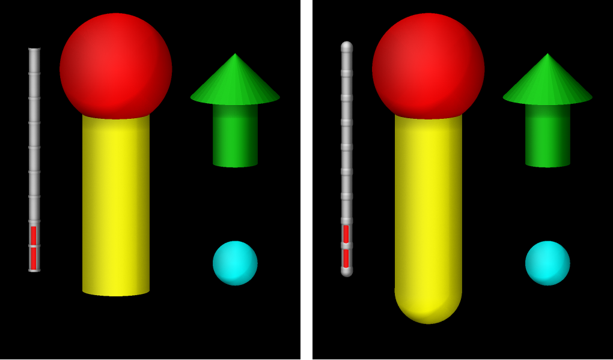

.. index:: fix graphics/objects

fix graphics/objects command
============================

Syntax
""""""

.. code-block:: LAMMPS

   fix ID group-ID graphics/objects Nevery keyword args ...

* ID, group-ID are documented in :doc:`fix <fix>` command
* graphics/objects = style name of this fix command
* Nevery = update graphics information every this many time steps
* one or more keyword/args pairs may be appended
* keyword = *sphere* or *cylinder* or *arrow* or *cone* or *progbar*

  .. parsed-literal::

       *sphere* args = type x y z R
         type = an atom type value to select the color of the sphere
         x, y, z = position of the center of the sphere (distance units)
         R = sphere radius (distance units)
         any of x, y, z, and R can be a variable (see below)
       *cylinder* args = type x1 y1 z1 x2 y2 z2 R
         type = an atom type value to select the color of the cylinder
         x1, y1, z1, x2, y2, z2 = positions of the centers at the two ends of the cylinder (distance units)
         R = cylinder radius (distance units)
         any of x1, y1, z1, x2, y2, z2, and R can be a variable (see below)
       *arrow* args = type x1 y1 z1 x2 y2 z2 R ratio
         type = an atom type value to select the color of the arrow
         x1, y1, z1, x2, y2, z2 = positions of the centers at the bottom (x1,y1,z1) and the tip (x2,y2,z2) of the arrow (distance units)
         R = cylinder radius (distance units)
         ratio = tip to body ratio (unitless)
         any of x1, y1, z1, x2, y2, z2, and R can be a variable (see below)
       *cone* args = type x1 y1 z1 x2 y2 z2 R1 R2 sides
         type = an atom type value to select the color of the cone
         x1, y1, z1, x2, y2, z2 = positions of the centers at the bottom (x1,y1,z1) and the top (x2,y2,z2) of the arrow (distance units)
         R1 = bottom radius (distance units)
         R2 = top radius (distance units)
         sides = bitmap value between 0 and 7 deciding whether bottom cap (1), top cap (2) or side (4) is drawn (unitless)
         any of x1, y1, z1, x2, y2, z2, R1 and R2 can be a variable (see below)
       *progbar* args = type1 type2 dim x y z length R ratio tics
         type1 = an atom type value to select the color of the progress bar body and the tics
         type2 = an atom type value to select the color of the progress indicator
         dim = *x* or *y* or *z*, direction of the progress bar
         x, y, z = position of the progress bar center (distance units)
         length = length of progress bar (distance units)
         R = cylinder radius (distance units)
         ratio = progress status (unitless)
         tics = number of tics (unitless)
         only the progress ratio value can be a variable (see below)

Examples
""""""""

.. code-block:: LAMMPS

   fix 1 all graphics/objects 100 sphere 1 0.0 0.0 15.0 3.0 sphere 2 0.0 0.0 5.0 1.0
   fix 1 all graphics/objects 1000 sphere 1 v_x v_y 0.0 v_radius cylinder 1 v_x v_y 0.0 v_x v_y 10.0 3.0
   fix 2 all graphics/objects 100 progbar 3 1 z 0.012 -0.012 0.0025 0.03 0.0003 v_prog 10

Description
"""""""""""

.. versionadded:: TBD

This fix allows to add arbitrary objects to images rendered with
:doc:`dump image <dump_image>` using the *fix* keyword.

The *group-ID* is ignored by this fix.

The *Nevery* keyword determines how often the graphics object data is
updated.  This should be the same value as the corresponding *N*
parameter of the :doc:`dump <dump>` image command.  LAMMPS will stop
with an error message if the settings for this fix and the dump command
are not compatible.

Available graphics objects are (see above for exact command line syntax):

- *sphere* - a sphere defined by its center location and its radius
- *cylinder* - a cylinder defined by its two center endpoints and its radius
- *arrow* - a cylinder with a cone at one side (see note below)
- *cone* - a truncated cone with a flat circular cap at either side (see note below)
- *progbar* - progress bar a long a selected axis and with optional tick marks

The *type* quantity determines the color of the object.  Its represents
an *atom* type and the object will be colored the same as the
corresponding atom type when the "type" or "element" color style is used
in the :doc:`dump image fix <dump_image>` command.  For the *progbar*
object **two** atom type values must be specified.  For color style
"const" the color will be set globally to the same color for *all*
objects of this fix instance, which can be changed using a :doc:`dump
modify fcolor <dump_image>` command.  The transparency is by default
fully opaque and can be changed globally with *dump\_modify ftrans*\ .

The *x*\, *y*\, and *z* parameters correspond to the position of the
center of the object (*sphere* and *progbar*). *x1*\, *y1*\, and *z1* as
well as *x2*\, *y2*\, and *z2* are instead representing the top and
bottom position of a graphics object (*cylinder*, *arrow*, and *cone*).
The *R* parameter determines the radius.  For the *cone* object there is
a bottom radius (*R1*) and top radius (*R2*).

The *cone* object has an additional setting that selects whether the
circular cap at the bottom (value = 1), or the circular cap at the top
(value = 2) or the side (value = 4) is drawn. The values are added and
thus if the cone with both caps and the side should be drawn the
required sides setting would be 7.

The *progbar* object has four additional parameters: *dim* sets the
direction of the progress bar, "x", "y", or "z"; *length* sets the
length of the entire object; *ratio* sets the ratio of progress and is
expected to be between 0.0 and 1.0 (larger or smaller values will be
reset to 1.0 or 0.0, respectively); and *tics* determines the number of
tics shown on the progress bar, this must be a number between 0 and 20.
Unlike for the other graphics objects, all settings except for *ratio*
are fixed and cannot be a variable reference.

----------------------

Many of the quantities defining a graphics object can be specified as an
equal-style :doc:`variable <variable>`, namely *x*, *y*, *z*, or *R* for
a *sphere* or *x1*, *y1*, *z1*, *x2*, *y2*, *z2*, or *R* for a
*cylinder* or *x1*, *y1*, *z1*, *x2*, *y2*, *z2*, *R1*, or *R2* for a
*cone*.  If any of these values is a variable, it should be specified as
`v_name`, where `name` is the variable name.  In this case, the variable
will be evaluated each *Nevery* timestep, and its value used to define
the graphics object location, orientation, or size.

Note that equal-style variables can specify formulas with various
mathematical functions, and include :doc:`thermo_style <thermo_style>`
command keywords for the simulation box parameters and timestep and
elapsed time.  Thus it is easy to specify graphics object properties
like position, orientation, radius or more that change as a function of
time or span consecutive runs in a continuous fashion.  For the latter,
see the *start* and *stop* keywords of the :doc:`run <run>` command and
the *elaplong* keyword of :doc:`thermo_style custom <thermo_style>` for
details.

For example, if a sphere's x-position is specified as v_x, then this
variable definition will keep its center at a relative position in the
simulation box, 1/4 of the way from the left edge to the right edge,
even if the box size changes:

.. code-block:: LAMMPS

   variable x equal "xlo + 0.25*lx"

Similarly, either of these variable definitions will move the sphere
from an initial position at 2.5 at a constant velocity of 5:

.. code-block:: LAMMPS

   variable x equal "2.5 + 5*elaplong*dt"
   variable x equal vdisplace(2.5,5)

If a sphere's radius is specified as v_r, then these variable
definitions will grow the size of the sphere at a specified rate.

.. code-block:: LAMMPS

   variable r0 equal 0.0
   variable rate equal 1.0
   variable r equal "v_r0 + step*dt*v_rate"

Dump image info
"""""""""""""""

.. versionadded:: TBD

Fix graphics/objects is designed to be used with the *fix* keyword of :doc:`dump
image <dump_image>`.  The fix will pass geometry information about the
objects listed on the command line to *dump image* so that they are
included in the rendered image.

The *fflag1* setting of *dump image fix* determines whether cylinder
elements are capped with spheres: 0 means no caps, 1 means the lower end
is capped, 2 means the upper end is capped, and 3 means both ends are
capped.  This applies to the *cylinder* object and the elements of the
*progbar* object.

The *fflag2* setting allows you to adjust the radius of the rendered
sphere, cylinder or cone items comprising the objects.  Since the radius
of these objects is an input parameter for this fix, it is recommended
to set this flag to 0.0.

   Example of graphics objects rendered with *fix graphics/objects* with
   *fflag1* setting of 0 (left) and 3 (right)

These images were created with the following input file:

.. code-block:: LAMMPS

   units           si
   region      simulation_box block -0.01 0.01 -0.01 0.01 -0.01 0.01 units box
   create_box 5 simulation_box
   mass * 1

   variable xpos equal 0.004*sin(PI*step/1000)
   variable ypos equal 0.004*cos(PI*step/1000)
   variable zpos equal 5.0*v_xpos
   variable prog equal (step)/10000.0
   fix gra all graphics/objects 50 sphere 5 v_xpos v_ypos -0.009 0.002 &
                           sphere 1 0.01 -0.005 0.01 0.005 &
                           progbar 3 1 z 0.012 -0.012 0.002 0.02 0.0005 v_prog 10 &
                           cylinder 4 0.01 -0.005 -0.01 0.01 -0.005 0.01 0.003  &
                           arrow 2 v_xpos v_ypos 0.0 v_xpos v_ypos 0.01 0.002 0.4

   dump viz all image 100 myimage2-*.ppm type type size 500 600 zoom 1.24872 &
                 shiny 0.2 fsaa yes ssao yes 4539 0.6 box no 0.01 axes no 0.5 0.025 &
                 fix gra type 3 0 view 80 10 center s 0.4 0.3 0.4
   dump_modify viz pad 9 backcolor black  acolor 3 gray

   run 2000

Restart, fix_modify, output, run start/stop, minimize info
"""""""""""""""""""""""""""""""""""""""""""""""""""""""""""

No information about this fix is written to :doc:`binary restart files
<restart>`.

None of the :doc:`fix_modify <fix_modify>` options apply to this fix.

Restrictions
""""""""""""

This fix is part of the GRAPHICS package.  It is only enabled if LAMMPS
was built with that package.  See the :doc:`Build package
<Build_package>` page for more info.

Related commands
""""""""""""""""

:doc:`fix graphics/arrows <fix_graphics_arrows>`,
:doc:`fix graphics/labels <fix_graphics_labels>`,
:doc:`fix graphics/isosurface <fix_graphics_isosurface>`,
:doc:`fix graphics/periodic <fix_graphics_periodic>`

Default
"""""""

none
