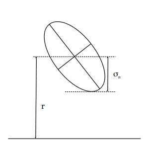

.. index:: fix wall/ees
.. index:: fix wall/region/ees

fix wall/ees command
====================

fix wall/region/ees command
===========================

Syntax
""""""

.. code-block:: LAMMPS

   fix ID group-ID style args

* ID, group-ID are documented in :doc:`fix <fix>` command
* style = *wall/ees* or *wall/region/ees*

  .. parsed-literal::

       args for style *wall/ees*\ : one or more *face parameters* groups may be appended
       face = *xlo* or *xhi* or *ylo* or *yhi* or *zlo* or *zhi*
       parameters = coord epsilon sigma cutoff
         coord = position of wall = EDGE or constant or variable
           EDGE = current lo or hi edge of simulation box
           constant = number like 0.0 or -30.0 (distance units)
           variable = :doc:`equal-style variable <variable>` like v_x or v_wiggle
         epsilon = strength factor for wall-particle interaction (energy or energy/distance\^2 units)
           epsilon can be a variable (see below)
         sigma = size factor for wall-particle interaction (distance units)
           sigma can be a variable (see below)
         cutoff = distance from wall at which wall-particle interaction is cut off (distance units)

  .. parsed-literal::

       args for style *wall/region/ees*\ : *region-ID* *epsilon* *sigma* *cutoff*
         region-ID = region whose boundary will act as wall
         epsilon = strength factor for wall-particle interaction (energy or energy/distance\^2 units)
         sigma = size factor for wall-particle interaction (distance units)
         cutoff = distance from wall at which wall-particle interaction is cut off (distance units)

Examples
""""""""

.. code-block:: LAMMPS

   fix wallhi all wall/ees xlo -1.0 1.0 1.0 2.5 units box
   fix wallhi all wall/ees xhi EDGE 1.0 1.0 2.5
   fix wallhi all wall/ees v_wiggle 23.2 1.0 1.0 2.5
   fix zwalls all wall/ees zlo 0.0 1.0 1.0 0.858 zhi 40.0 1.0 1.0 0.858

   fix ees_cube all wall/region/ees myCube 1.0 1.0 2.5

Description
"""""""""""

Fix *wall/ees* bounds the simulation domain on one or more of its
faces with a flat wall that interacts with the ellipsoidal atoms in
the group by generating a force on the atom in a direction
perpendicular to the wall and a torque parallel with the wall.  The
energy of wall-particle interactions E is given by:

.. math::

   E = \epsilon \left[ \frac{2 \sigma_{LJ}^{12} \left(7 r^5+14 r^3
   \sigma_{n}^2+3 r \sigma_{n}^4\right) }{945
   \left(r^2-\sigma_{n}^2\right)^7} -\frac{ \sigma_{LJ}^6 \left(2 r
   \sigma_{n}^3+\sigma_{n}^2 \left(r^2-\sigma_{n}^2\right)\log{
   \left[\frac{r-\sigma_{n}}{r+\sigma_{n}}\right]}\right) }{12
   \sigma_{n}^5 \left(r^2-\sigma_{n}^2\right)} \right]\qquad \sigma_n
   < r < r_c

Introduced by Babadi and Ejtehadi in :ref:`(Babadi2)
<BabadiEjtehadi>`. Here, *r* is the distance from the particle to the
wall at position *coord*, and Rc is the *cutoff* distance at which
the particle and wall no longer interact. Also, :math:`\sigma_n` is
the distance between center of ellipsoid and the nearest point of its
surface to the wall as shown below.

Details of using this command and specifications are the same as
fix/wall command. You can also find an example in USER/ees/ under
examples/ directory.

The prefactor :math:`\epsilon` can be thought of as an
effective Hamaker constant with energy units for the strength of the
ellipsoid-wall interaction.  More specifically, the :math:`\epsilon`
prefactor is

.. math::

   8 \pi^2 \quad \rho_{wall} \quad \rho_{ellipsoid} \quad \epsilon
   \quad \sigma_a \quad \sigma_b \quad \sigma_c

where :math:`\epsilon` is the LJ energy parameter for the constituent
LJ particles and :math:`\sigma_a`, :math:`\sigma_b`, and
:math:`\sigma_c` are the radii of the ellipsoidal
particles. :math:`\rho_{wall}` and :math:`\rho_{ellipsoid}` are the
number density of the constituent particles, in the wall and ellipsoid
respectively, in units of 1/volume.

.. note::

   You must ensure that r is always bigger than :math:`\sigma_n` for
   all particles in the group, or LAMMPS will generate an error.  This
   means you cannot start your simulation with particles touching the wall
   position *coord* (:math:`r = \sigma_n`) or with particles penetrating
   the wall (:math:`0 =< r < \sigma_n`) or with particles on the wrong
   side of the wall (:math:`r < 0`).

Fix *wall/region/ees* treats the surface of the geometric region defined
by the *region-ID* as a bounding wall which interacts with nearby
ellipsoidal particles according to the EES potential introduced above.

Other details of this command are the same as for the :doc:`fix
wall/region <fix_wall_region>` command.  One may also find an example
of using this fix in the examples/PACKAGES/ees/ directory.

----------

Restart, fix_modify, output, run start/stop, minimize info
"""""""""""""""""""""""""""""""""""""""""""""""""""""""""""

No information about these fixes are written to :doc:`binary restart
files <restart>`.

The :doc:`fix_modify <fix_modify>` *energy* option is supported by
these fixes to add the energy of interaction between atoms and all the
specified walls or region wall to the global potential energy of the
system as part of :doc:`thermodynamic output <thermo_style>`.  The
default settings for these fixes are :doc:`fix_modify energy no
<fix_modify>`.

The :doc:`fix_modify <fix_modify>` *respa* option is supported by
these fixes. This allows to set at which level of the :doc:`r-RESPA
<run_style>` integrator the fix is adding its forces. Default is the
outermost level.

These fixes computes a global scalar and a global vector of forces,
which can be accessed by various :doc:`output commands
<Howto_output>`.  See the :doc:`fix wall <fix_wall>` command for a
description of the scalar and vector.

No parameter of these fixes can be used with the *start/stop* keywords of
the :doc:`run <run>` command.

The forces due to these fixes are imposed during an energy
minimization, invoked by the :doc:`minimize <minimize>` command.

.. note::

   If you want the atom/wall interaction energy to be included in
   the total potential energy of the system (the quantity being
   minimized), you MUST enable the :doc:`fix_modify <fix_modify>` *energy*
   option for this fix.

-----------------

Dump image info
"""""""""""""""

.. versionadded:: TBD

Fix *wall/ees* fix supports the *fix* keyword of :doc:`dump image
<dump_image>`.  The fix will pass geometry information about the walls
to *dump image* so that the walls will be included in the rendered
image.  Please note, that for :doc:`2d systems <dimension>`, a wall
rendered as a plane would be invisible and it is thus rendered as a
cylinder.  Fix *wall/ees/region* does **not** support graphics info, but
the region can be visualized with the *region* keyword of :doc:`dump
image <dump_image>`.

The color of the wall is by default that of the first atom type when
using color styles "type" or "element".  With color style "const" the
default value of "white" can be changed using :doc:`dump_modify fcolor
<dump_image>`.  The transparency is by default fully opaque and can be
changed with *dump\_modify ftrans*\ .

For 2d systems, the *fflag1* setting determines whether the cylinder
representing the wall is capped with a sphere at the ends: 0 means no caps, 1
means the lower end is capped, 2 means the upper end is capped, and 3
means both ends are capped.  The *fflag2* setting allows to adjust the
radius of the rendered cylinder.  It should be set to a value > 0 or the
cylinder will not be visible since the diameter is set internally to
zero due to lack of a suitable heuristic for deriving a meaningful
diameter for all types of walls and unit settings.

For 3d systems, both *fflag1* and *fflag2* are ignored.

------------

Restrictions
""""""""""""

These fixes are part of the EXTRA-FIX package.  They are only enabled
if LAMMPS was built with that package.  See the :doc:`Build package
<Build_package>` page for more info.

These fixes requires that atoms be ellipsoids as defined by the
:doc:`atom_style ellipsoid <atom_style>` command.

Related commands
""""""""""""""""

:doc:`fix wall <fix_wall>`,
:doc:`pair resquared <pair_resquared>`

Default
"""""""

none

----------

.. _BabadiEjtehadi:

**(Babadi2)** Babadi and Ejtehadi, EPL, 77 (2007) 23002.
